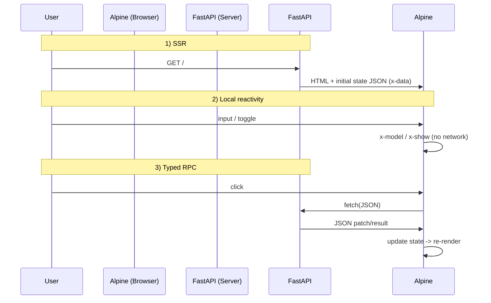

# Specification: Architecture

## 1. Goal

MustWebUI is designed as a UI framework (and effectively a compiler) built around FastAPI + Pydantic, with three non-negotiable properties:

- **SSR-first**: fast initial paint from server-rendered HTML.
- **Lightweight reactivity**: Alpine.js handles local updates (input binding, conditional display) without network calls.
- **Typed RPC**: UI code calls server endpoints via **Python function objects** and **Pydantic models** (not string URLs).

## 2. System components

- **FastAPI (server)**
  - hosts normal API routes.
  - hosts MustWebUI pages (SSR) as regular HTTP routes.
  - MUST expose enough routing metadata so MustWebUI can resolve `Callable → URL`.

- **MustWebUI (compiler/runtime)**
  - registers pages via `@ui.page(path, state=...)`.
  - converts DSL (`ml.*`) + Actions (`btn.*`) into:
    - SSR HTML
    - Alpine directives/expressions (`x-data`, `x-model`, `x-text`, `x-show`, event handlers)
    - a tiny runtime helper (e.g. `$api`) for fetch + JSON.
  - serializes initial State safely.

Component coverage for the initial version is listed in:
- [component-catalog.md](component-catalog.md)

- **Browser (Alpine.js)**
  - owns live state in `x-data`.
  - updates DOM via Alpine v3 directives.
  - executes async handlers that call `$api(...)` and apply results back into state.

## 3. Artifact contract (what MustWebUI generates)

For any page, MustWebUI MUST be able to generate:

- **HTML structure** (plain HTML tags)
- **Initial state** (JSON) embedded in an XSS-safe way (see [spec-security-ops.md](spec-security-ops.md))
- **Alpine bindings**
  - `x-data` creation that points at the initial state
  - `x-model` for inputs
  - `x-text` for text
  - `x-show` for conditional display
- **Event handlers**
  - `@click` etc containing an `async` expression when actions include RPC
  - `try/finally` when actions include cleanup (e.g. loading flags)

## 4. Request/response flow

### 4.1 SSR (initial render)

1. Browser requests `GET /`.
2. FastAPI executes the registered page handler.
3. MustWebUI returns HTML that includes:
   - initial state JSON
   - Alpine runtime setup
   - compiled event handlers.

Requirements:
- Initial state MUST come from `StateModel` defaults / factories.
- State embedding MUST be XSS-safe.

### 4.2 Local reactivity (no network)

- input: `x-model` updates state instantly.
- visibility: `x-show` toggles instantly.
- text: `x-text` reads state instantly.

MustWebUI MUST compile `state.some_field` (a proxy) into the correct JS identifier/path.

### 4.3 Typed RPC (network)

1. User triggers an event.
2. Alpine executes the compiled handler.
3. Handler calls `$api(resolved_url, payload)`.
4. Response JSON is applied to state (explicit `btn.set`), updating the UI.

Requirements:
- Must resolve **function object → URL** deterministically.
- Payload/response MUST follow Pydantic models declared on the server.

## 5. Page registration

### 5.1 API surface (minimal)

- `ui = MustWebUI(app: FastAPI, *, config: ... = ...)`
- `@ui.page(path: str, *, state: type[BaseModel])`

Page handler signature (minimal):

- `def page(ml, state: StateModel) -> str`

### 5.2 Responsibility of a page handler

The page handler is not “rendering HTML manually”. It:

- builds a node tree via the DSL
- embeds State proxies (Expr)
- declares Actions (instruction sequences)

and then returns `ml.render()`.

## 6. Compatibility / constraints

- Alpine.js v3
- Standard FastAPI routing
- No browser-side Python execution

## 7. Sequence diagram (reference)

